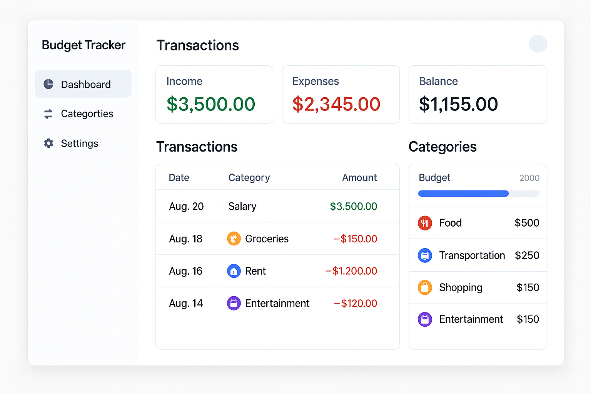

## TODO

- [x] Cadastro de receitas e despesas
- [ ] Categorias personalizaveis
- [ ] Orçamento mensal por categoria
- [ ] Saldo por conta
- [ ] Resumo mensal
- [ ] Inserção de despesas futuras
- [ ] Despesas recorrentes
- [ ] Objetivos financeiros
- [ ] Divisão de despesas
- [ ] Alertas e notificações
- [ ] Dashboard com gráficos
- [ ] Tendências de gastos
- [ ] Relatórios exportáveis
- [ ] Login com autenticação
- [ ] Backup automático na núvem
- [ ] Sincronização entre dispositivos
- [ ] Análise com IA
- [ ] Reconhecimento de nota fiscal ou recibo via OCR
- [ ] Integração com bancos (OpenFinance)
- [ ] Modo colaborativo familiar
- [ ] Modo viagem (gastos temporarios em outras moedas)

## Interface de exemplo

## Bibliotecas

### Back end

- FastAPI com banco MySQL
- OAuth2 com JWT
- passlib
